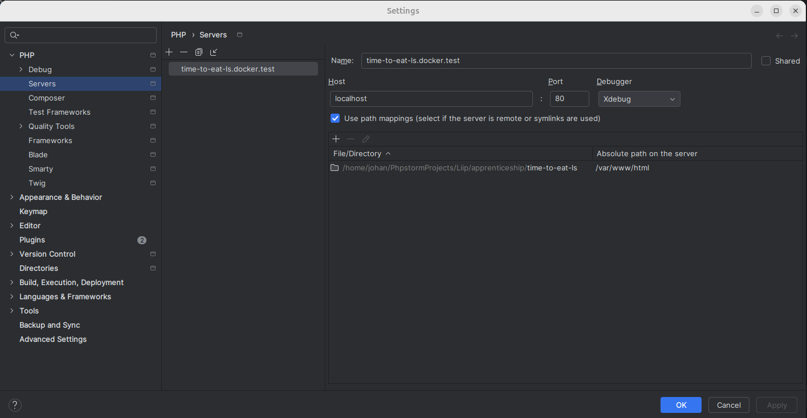
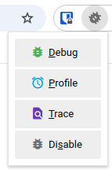
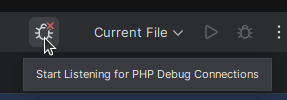

## Enabling XDebug debugging

### Update the PHPStorm Configuration

- Go to Preferences > Languages & Frameworks > PHP > Servers.
- Click the + button to add a new server.
- follow the screenshot below:

CAUTION: both server name MUST match the `PHP_IDE_CONFIG` environment variable. In this case "time-to-eat-ls.docker.test"
It relies on the environment variable defined in the `compose.yml` file.

### Install XDebug extension

https://chromewebstore.google.com/detail/xdebug-helper-by-jetbrain/aoelhdemabeimdhedkidlnbkfhnhgnhm?hl=en

You can use this extension to enable/disable XDebug on the fly.
The link is for Chrome, but you can find it for Firefox as well.

### 6. Start Debugging

When you want to debug your PHP application, you will have to

- add a breakpoint in your code and start the debugging in PHPStorm.
- activate the debugging in you navigator using the XDebug extension.
  
- tell your IDE that you want to listen to the incoming connection.
  
